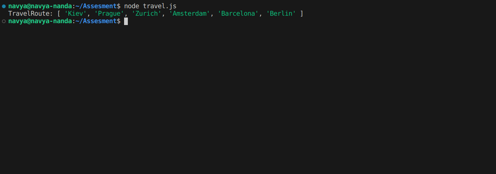

# HTML & CSS Design

This project demonstrates a simple **HTML & CSS** design. It consists of four diagonal bars surrounding the text "HTML&CSS"
## Files
- **index.html**: Contains the HTML structure for the design.
- **work.css**: Contains custom CSS for the design (if using plain CSS).
- **travel.js**:Algorithm code
- **logo.png**: Screenshot of the final output of the logo.
- **algorithm.png**:Screenshot of the final output.

## Screenshot

